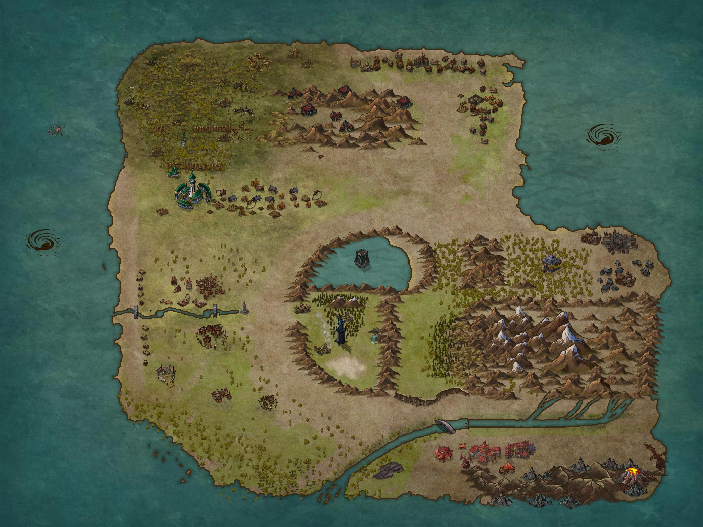

# hyrstgeard

## Quick Intro
After a millenia of peace and order in the massive world of Hyrstgeard, greed begins to take hold of restless minds. The expensive mistakes of past wars begin to fade from even the oldest memories. The world that was thought to be fully known, it turns out, bears many more secrets to discover, and ancient powers to tame.

## Access to Magic
There are only two known sources of magic in Hyrstgeard: ancestry & divinity:
* *Fey Ancestry*: Elves & Gnomes are races originally from the Feywild, and they innately carry the spark of wild magic within them
* *Dragon Ancestry*: Dragonborn inherit their magical abilities from their Dragon ancestors
* *Divine Bestowment*: Clerics & Paladins receive their magical powers from their deity. And if they displease their deity, their access to magic can be revoked.

And that's it: You can’t just learn you some magic (ala wizards). So all non-divine spellcasting is limited to the races above. 
Resurrection is not a thing. Death is final.

## Races
* Limited to Humans, (half) Orcs, (half) Elves, Halflings, Dwarves, Gnomes, Goliaths, Goblins, Dragonborn (no tieflings, yet)

## Geography & Map

  
World Map

## Kingdoms, Culture & Important Places
Template:
* Official Language (& IRL language)
* Government Type
* Customs & Laws

  
Major Factions

#### Vulkanheim, Dragonborn Kingdom
* Draconic (German)
* Monarchy, passing to eldest heir
* Situated in the foothills of the Southern Mountains, where dragons used to live before they were hunted to extinction, often by the dragonborn themselves, out of defense.
  
#### Federation of Orcen Tribes
* Orc (_?)
* Republic / Meritocracy: Each village's chieftain fights for his right to lead. All chieftains meet to set nation-wide policy and law. One of them is selected as chairman and arbiter of disputes. 

#### City-state Tripoli, and surrrounding metropolitan sprawl
* Primarily Elvish (Russian), but almost all other cultures can be found here
* City itself is constructed vertically on 3 cocentric circular platforms, each smaller than the one below. 
    * The "Ground" level is home to the common folks, merchants, and the hero guild, which is the only form of law enforcement. There are temples here that the clergy run. But this is also the most diverse and secular part of the city. 
      * map: https://inkarnate.com/m/W2x8oz--tripoli-base-2/
    * The "Middle" level, aka The Old City, aka The Houses, is home to multiple noble families that together own, fund, or manage many of the city's non-clerical aspects. Of the 5 most powerful families currently in power, 4 are elves, one human.
      * the old city is also home to the academia, and most of the clergy.
    * The "Upper" tier houses the main temple, the Volkhev (religious leader),  the highest order of paladins and clerics
* Ultimately a theocracy: elected officials work alongside clergy of Elhonna, the goddess of life, but true decisions are made by the clergy
  * Ranks:  Volkhev (Brotor) -> Divine Council -> Divine Guard (Paladins) -> Priests -> Guards -> Clerics -> Initiate/Acolytes

#### Hooman Kingdom (Name TBD)
* Common (English)
* Monarchy; The king also sits as one of the members of the Orc chieftain council, but has never been selected as the chairman.
#### Dwarven Kingdom Range
* Dwarven (Celtic?)

#### Dwarven Mining Stronghold
* The mines circle the large inland sea of _ 
* In the center is the world's most impregnable prison. Built by dwarves, houses criminals and monsters from all of hyrstgeard

#### Goblin Kingdom
* Goblin (gibberish)
* Monarchy: who ever kills the king becomes the king. No goblin king has died of old age in the past 500 years

#### The Goliath Mountain Nation 
* Goliath (Mongolian)
* villages recently united under 1 khan in wartime; As wartime has ended, they're still figuring this out. 

#### The Halfling Forest Nation
* Halfing (_ ?)
* City-states that live in the _ forest

## History
Reconsidering how much of this is common lore, how much of this is uncovered from encouters

  
1500 years ago

- shit went down

  
1000 years ago

- shit calmed down
- also, no more dragons :'(

  
500 years ago

- shit got boring

  
last 100 years

- peeps be getting restless and greedy

## Themes/Tones/Etc

  
Expand

* Settings Available: Rural, small town, big cities, mines, hideouts, mountains
* Encounter Types: Standard Hero Stuff; Spy/Espionage/Assassinations; Character Arcs; Epic Battles; Unique Environments; Role Playing; Hunts; Heists; Rescue Missions; Gladiator Arenas; Sporting Events; 
* No plans for large scale warfare (but then, whatever happens happens). Expect mostly tactical combat. 

## Other Mechanics (Planes ‘n Such)
Blah
